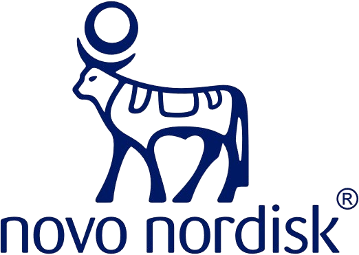

## Welcome to Novo Nordisk's Open-Source projects  

NovoNordisk-OpenSource is the home of our public Open-Source projects developed at Novo Nordisk.

You will find projects centered around reporting of clinical trials.

For more information see the overview of [R packages](https://novonordisk-opensource.github.io/R-packages/) and the pinned repositories below.
